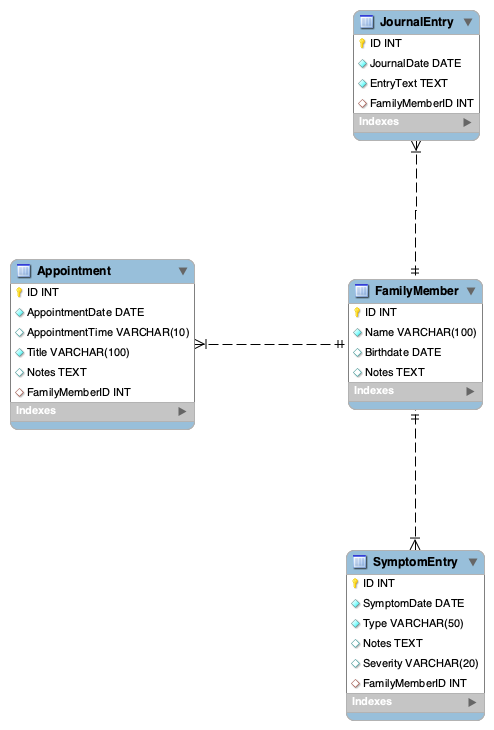
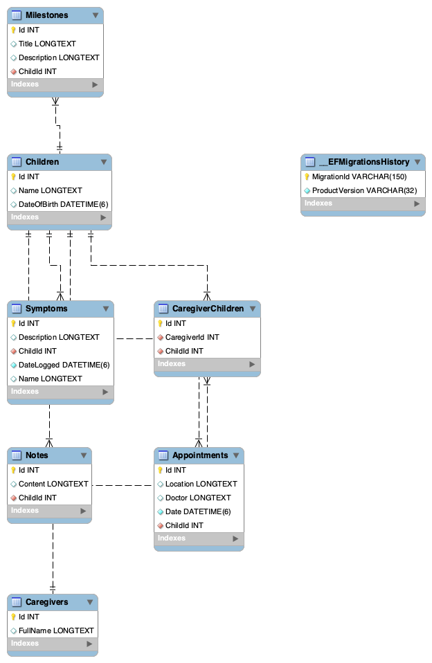

# Medical Journey Log – Project Portfolio

---

## Project Overview

**Medical Journey Log** is a web application designed to help caregivers track, log, and organize symptoms for children with medical conditions. It provides a simple interface for adding children, recording symptoms, editing entries, and viewing each child’s full medical history in one place.

The project was developed as the final capstone for:

- **CST-451 – Senior Project I**
- **CST-452 – Senior Project II**
- **Institution:** Grand Canyon University
- **Developer:** Alex Frear

**Technology Stack:**

- ASP.NET Core (.NET 7)
- Razor Pages
- C#
- MySQL
- HTML/CSS
- Visual Studio for Mac

---

## Project Purpose

The application was inspired by real family medical needs. Managing a child’s ongoing medical treatments, appointments, and symptoms can be overwhelming, especially when information is scattered across notes, messages, and memory.

The purpose of the Medical Journey Log is to:

- Give caregivers a centralized place to log symptoms and events.
- Make it easier to review patterns over time.
- Provide a lightweight, personal-use tool without unnecessary complexity.
- Support families in staying organized through challenging medical journeys.

The system is designed for **personal, local use** by one or two caregivers on a single machine.

---

## System Architecture

The Medical Journey Log is built using a layered architecture:

- **Presentation Layer:** Razor Pages (.cshtml)
- **Logic Layer:** PageModel classes (.cshtml.cs) handling GET/POST logic
- **Data Layer:** MySQL relational database
- **Relationship Model:** One-to-many (each child can have many symptom entries)

### Architecture Diagram

*(Insert your architecture diagram image here once uploaded to the repo. For example:)*

```markdown

```

---

## Database Schema

### Tables

**Child Table**

- ChildId
- Name
- DateOfBirth

**Symptom Table**

- SymptomId
- ChildId (foreign key to Child)
- Description
- Date

### Relationship

- One Child can have many Symptom records.
- Each Symptom belongs to exactly one Child.

### ER Diagram

*(Insert your ER diagram image here once uploaded, for example:)*

```markdown

```

---

## Application Features

### Child Management

- Add new child profiles with name and date of birth.
- Edit existing child information.
- Delete children, with guard logic that prevents deletion if they still have symptom records.

### Symptom Tracking

- Log new symptom entries for a selected child.
- Edit existing symptoms to correct or clarify information.
- Delete symptoms when no longer needed.
- View a full, date-ordered symptom history on the child details page.

### Data Integrity and Safety

- Guarded delete behavior so a child cannot be deleted while symptoms exist.
- Required field validation on all forms.
- Relational database structure ensures consistent, connected data.

---

## Screens and Workflow

Typical caregiver workflow:

1. Navigate to the Home (Index) page to see all children.
2. Click on a child to open the Child Details page and view their symptom history.
3. Use Log Symptom to add new entries as events occur.
4. Use Edit or Delete on symptoms when updates or removals are needed.
5. Use Edit Child to update demographic data if needed.
6. Use Delete Child only after all symptom records have been intentionally removed.

*(You can optionally add screenshots here, for example:)*

```markdown


```

---

## Testing and Quality Assurance

Testing was performed across multiple levels:

- **Unit Testing**
- **Integration Testing**
- **System Testing**
- **Regression Testing**

All critical test cases passed, and the final application is stable for its intended use.

---

## Security and Risk Considerations

The application is designed for local, personal use and does not implement multi-user authentication. Security considerations include:

- Local-only data storage
- No cloud exposure
- Server-side validation
- Guarded delete logic
- Dependence on OS-level security for machine access

---

## Demonstration Videos

- **Application Walkthrough:**  
  https://www.loom.com/share/9252d31ce9064b70950d87a07015f02c

- **Code Review and Explanation:**  
  https://www.loom.com/share/29e7e00f443d45c9b314e61060a7b9ab

---

## Source Code Repository

Full source code is available on GitHub:

https://github.com/amfrear/CST452/tree/main/Milestone 6

---

## Technology Showcase Poster

Download the poster (PDF):

(Insert poster link here)

---

## Project Documentation

- Milestone 1 – Project Proposal  
- Milestone 2 – Requirements  
- Milestone 3 – Architectural Plan  
- Milestone 4 – Development  
- Milestone 5 – Testing  
- Milestone 6 – Final Project Review  

---

## Lessons Learned

- Importance of realistic requirements  
- Guard logic and validation  
- Relational data modeling  
- Iterative development  
- Time management alongside real-life responsibilities  

---

## Christian Worldview Integration

This project reflects stewardship, compassion, and service by providing a tool that supports families during stressful medical journeys. It demonstrates how technical skills can be used to help others and bring organization to complex situations.

---

## Future Enhancements

- Symptom severity scales  
- Photo or document attachments  
- Reporting dashboards  
- CSV/PDF export  
- Mobile UI improvements  
- Optional authentication  
- Cloud synchronization  
- Additional child profile fields  

---

## About the Developer

**Alex Frear**  
Bachelor of Science in Software Development  
Grand Canyon University  

Focus Areas: Full-stack development, .NET, MySQL, and web application design.

